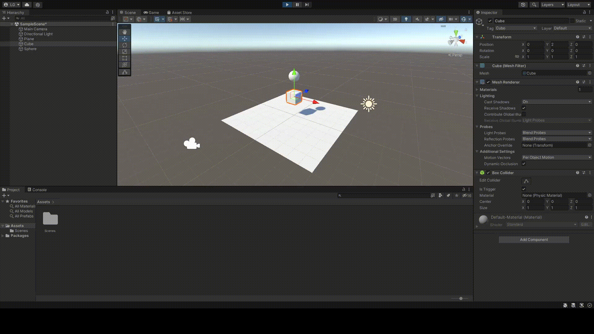
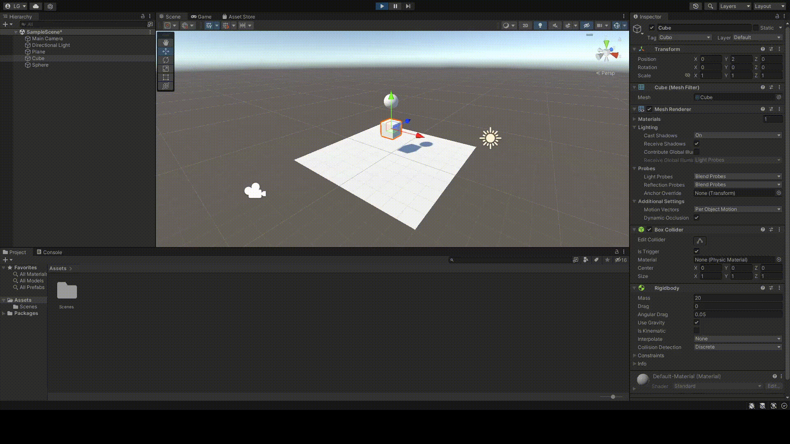
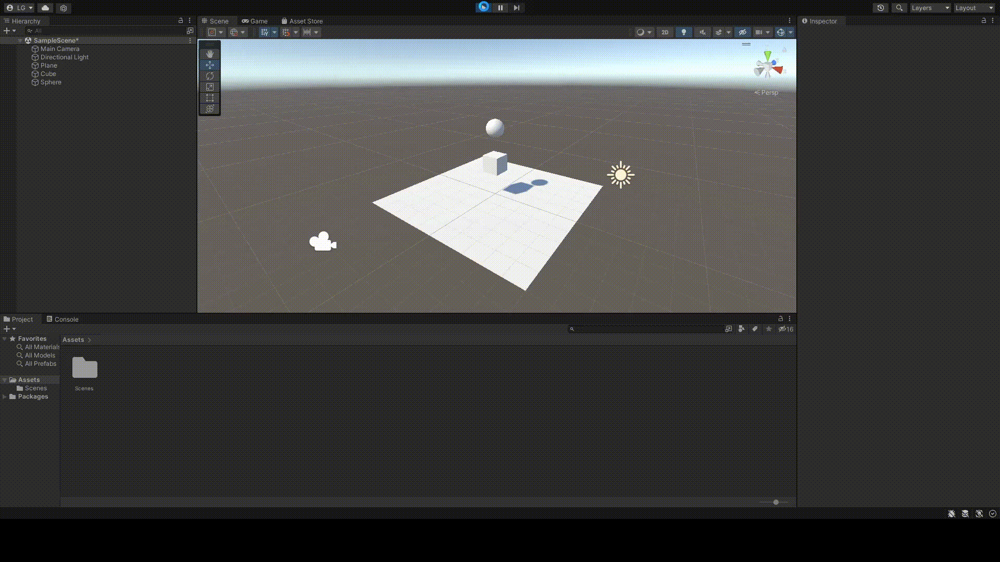
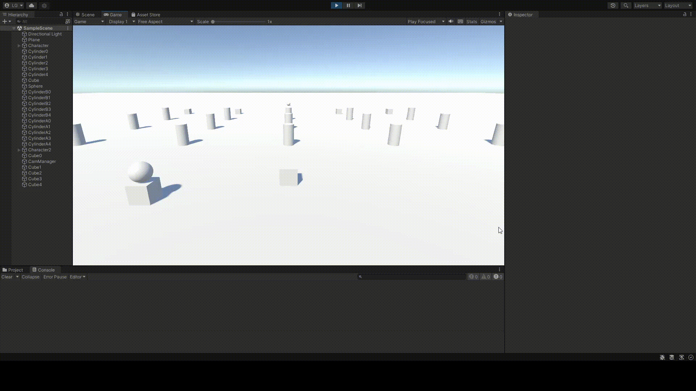

# Práctica 2: Introducción a los scripts y física en Unity
### Autor: Lorenzo Gabriel Pérez González

## Ejercicio 1: Probar configuraciones de objetos.
### Apartado a: Ninguno de los objetos será físico.
En esta sección, he colocado un cubo y una esfera en la escena. Ambas figuras se encuentran suspendidas en el aire y, dado que no son figuras físicas, no deben de caer, puesto que no les afecta la gravedad. De esta forma, al ejecutar la escena, vemos lo siguiente:

### Apartado b: La esfera tiene físicas, el cubo no.
En cambio, si convertimos la esfera en un objeto físico, será vulnerable a la fuerza de la gravedad. Para lograr dicho objetivo, he tenido que seleccionar la esfera y añadirle una componente **Rigidbody** que permitirá asignarle las propiedades físicas, además de aplicarle la casilla de *Use Gravity*. Al ejecutar la escena, vemos algo distinto al apartado anterior:

### Apartado c: La esfera y el cubo tienen físicas.
Para este apartado, he puesto un objeto encima de otro para ver que ocurre. Si le aplicamos físicas al cubo, obtendremos lo siguiente:

### Apartado d: La esfera y el cubo son físicos y la esfera tiene 10 veces la masa del cubo.
He asignado una masa de 10 kg al cubo y de 100 kg a la esfera. Decidí poner encima al objeto más pesado. Cuando ejecuté la escena vi que la esfera cae encima del cubo y poco a poco va desplazándose hacia un lado hasta caer sobre el plano y, más tarde, salir de éste.

### Apartado e: La esfera tiene físicas y el cubo es de tipo IsTrigger.
Para este apartado retiré el componente físico al cubo y le asigné un valor positivo a la propiedad *IsTrigger* dentro del **Box Collider**. De esta forma, se ve como en la escena, la bola, que está por encima, traspasa al cubo al caer.

### Apartado f: La esfera tiene físicas, el cubo es de tipo IsTrigger y tiene físicas.
En este apartado, tan sólo tuve que añadir de nuevo la componente de **RigidBody** al cubo, dejando marcada la casilla de *IsTrigger*. Al ejecutar, ambos objetos caen, pero el cubo traspasa el plano.

### Apartado g: La esfera y el cubo son físicos y la esfera tiene 10 veces la masa del cubo, se impide la rotación del cubo sobre el plano XZ.
Para completar este ejercicio, se colocan las configuraciones del apartado d y en la componente **RigidBody** del cubo, se añade una restricción de rotación a los ejes X y Z. De esta forma, la ejecución es similar a la del apartado d, salvo que la esfera no cae por el borde del cubo, puesto que se ha restringido una posible rotación que hacía que se moviese la bola.

## Ejercicio 2: Controlador de personaje.

Para cumplir con los requerimientos de este apartado, he desarrollado el script *Character.cs*. Este script tiene incluido un conjunto de atributos públicos que permitirán ajustar la velocidad de traslación y rotación del personaje desde el inspector de **Unity**. Además, dispone de un controlador según los ejes horizontales (controlan la rotación del personaje) y verticales (controlan la traslación del personaje). De esta forma, el personaje sólo avanzará hacia delante, mientras que la dirección estará controlada por el eje horizontal.

## Ejercicio 3: Acciones con el personaje y diferentes objetos.
### Apartado 1: Se deben incluir varios cilindros sobre la escena. Cada vez que el objeto jugador colisione con alguno de ellos, deben aumentar su tamaño y el jugador aumentar puntuación.

En este apartado necesité ampliar el script *Character.cs*, de modo que si detecta una colisión con el cilindro, aumente su puntuación. Por otra parte, dentro del editor de **Unity**, le apliqué un **Box Collider** y un **RigidBody** con la opción de *IsKinematic*, de modo que el sistema de movimiento siga siendo gobernado por la componente **Transform** y no por el motor físico. Además, tuve que generar un conjunto de cilindros que fueron dotados igualmente de un **Capsule Collider** y un **RigidBody**. Por último, apliqué a dichos cilindros un script *Cylinders.cs* cuyo contenido se resume en detectar una colisión con el jugador y aumentar el tamaño del cilindro en cuestión.

Como puede verse, en la consola se observa el aumento en la puntuación del jugador cada vez que colisiona con un cilindro. Además, me he fijado que al aumentar el tamaño en todos los ejes, la altura crece por debajo del mapa, colisionando y produciendo un salto de los cilindros.

### Apartado 2: Agregar cilindros de tipo A, en los que además, si el jugador pulsa la barra espaciadora los mueve hacia fuera de él. 

Para completar esta tarea, necesité modificar el script *Character.cs* con una condicional dentro de la función *Update()* que verifique si se ha pulsado el botón de espacio. En caso afirmativo, recuperará los objetos con la etiqueta *"CilindroA"* que participen en la escena y los alejará del jugador en dirección contraria a su posición.

