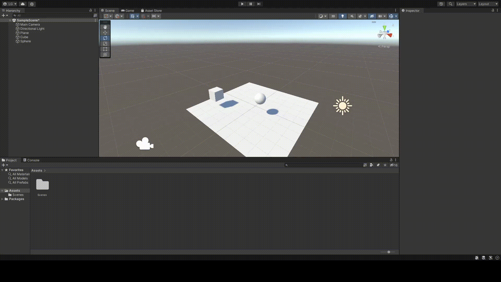
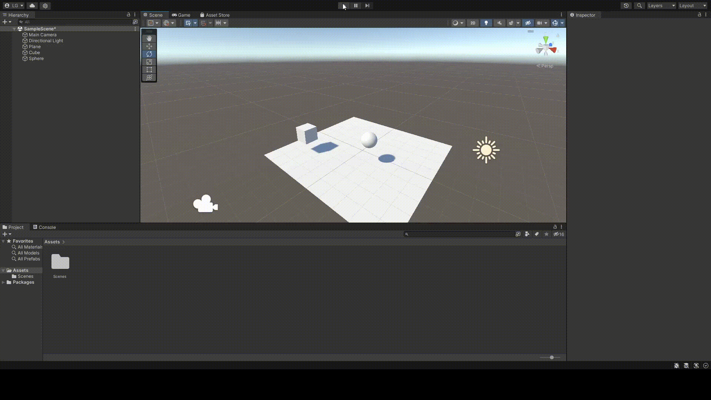
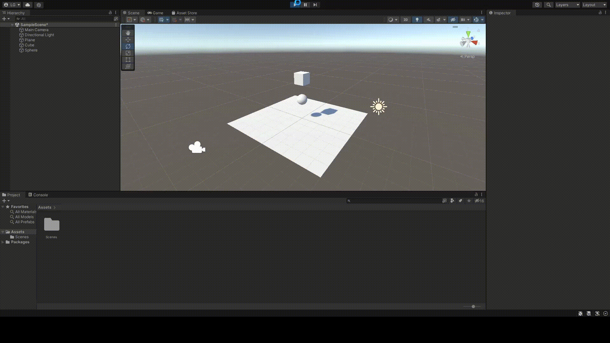
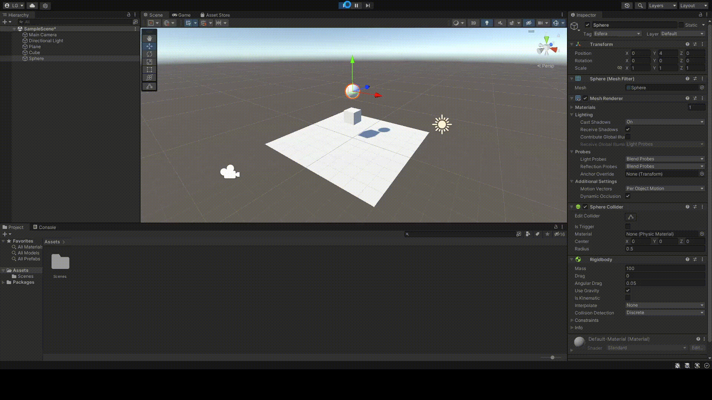

# Práctica 2: Introducción a los scripts y física en Unity
### Autor: Lorenzo Gabriel Pérez González

## Ejercicio 1: Probar configuraciones de objetos.
### Apartado a: Ninguno de los objetos será físico.
En esta sección, he colocado un cubo y una esfera en la escena. Ambas figuras se encuentran suspendidas en el aire y, dado que no son figuras físicas, no deben de caer, puesto que no les afecta la gravedad. De esta forma, al ejecutar la escena, vemos lo siguiente:

### Apartado b: La esfera tiene físicas, el cubo no.
En cambio, si convertimos la esfera en un objeto físico, será vulnerable a la fuerza de la gravedad. Para lograr dicho objetivo, he tenido que seleccionar la esfera y añadirle una componente **Rigidbody** que permitirá asignarle las propiedades físicas, además de aplicarle la casilla de *Use Gravity*. Al ejecutar la escena, vemos algo distinto al apartado anterior:

### Apartado c: La esfera y el cubo tienen físicas.
Para este apartado, he puesto un objeto encima de otro para ver que ocurre. Si le aplicamos físicas al cubo, obtendremos lo siguiente:

### Apartado d: La esfera y el cubo son físicos y la esfera tiene 10 veces la masa del cubo.
He asignado una masa de 10 kg al cubo y de 100 kg a la esfera. Decidí poner encima al objeto más pesado. Cuando ejecuté la escena vi que la esfera cae encima del cubo y poco a poco va desplazándose hacia un lado hasta caer sobre el plano y, más tarde, salir de éste.

